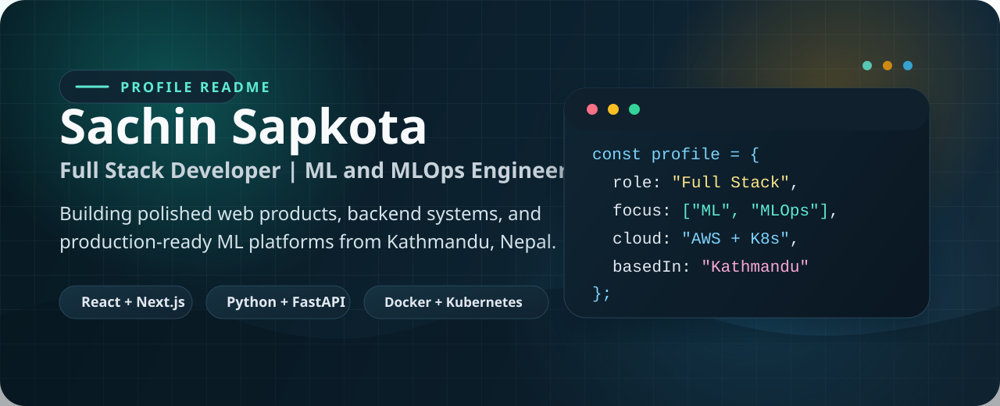
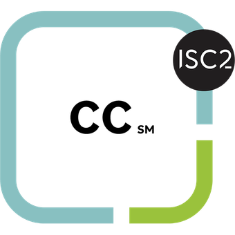

  

  
  
  

## About

I build full-stack products and machine learning systems with a focus on reliable delivery, clean interfaces, and production-ready infrastructure. My background combines frontend engineering, backend APIs, MLOps workflows, and cloud-native tooling.

- Based in Kathmandu, Nepal
- Full Stack Developer and ML & MLOps Engineer
- Bachelor's in Electronics, Communication and Information Engineering
- Interested in product engineering, machine learning, MLOps, and cloud platforms

## Focus Areas

| Area | Stack |
| --- | --- |
| Product Engineering | React, Next.js, Tailwind CSS, Node.js, Express.js |
| Backend Systems | Django, FastAPI, PostgreSQL, MongoDB, Redis |
| Machine Learning | PyTorch, scikit-learn, Hugging Face, YOLO, Pandas |
| Platform and Cloud | Docker, Kubernetes, Terraform, GitHub Actions, AWS |

## Tech Stack

  

## Certifications

  
  

- [AWS Certified Machine Learning Engineer - Associate](https://www.credly.com/badges/33df2838-8bbd-443a-98cc-612118ca8208) (2026)
- [Certified in Cybersecurity (CC)](https://www.credly.com/badges/45131044-91a5-4e89-b614-b86544842005) (2025)
- [AWS Academy Cloud Engineering](https://www.credly.com/badges/b80ec2ff-c9da-403f-aae6-daf4952557dd/public_url) (2023)
- [AWS Academy Data Engineering](https://www.credly.com/badges/9ff4bce2-31d2-46f1-aac9-684e1067dc74/public_url) (2024)
- [JavaScript Essentials 1](https://www.credly.com/badges/fdbed340-ff0d-4aaa-815d-73af10a7e2dc/public_url) (2024)
- [Introduction to Data Science](https://www.credly.com/badges/94a8b1c0-15d2-44ed-8583-c89d562a639b/public_url) (2024)

## Project Highlight

### Cyberattack Detection using Machine Learning

Built an intrusion detection system with Python, FastAPI, Node.js, and React that reached 98% classification accuracy for DDoS, DoS, and brute-force attack detection. The project combined model serving, real-time log processing, automated IP blocking, and retraining-ready data pipelines.

## Education

- Tribhuvan University, IOE Pulchowk Campus - Bachelor's in Electronics, Communication and Information Engineering (2019-2024)
- Valmiki Shikshya Sadan - Higher Secondary Education (2017-2019)

## GitHub Pulse

  
  

  

